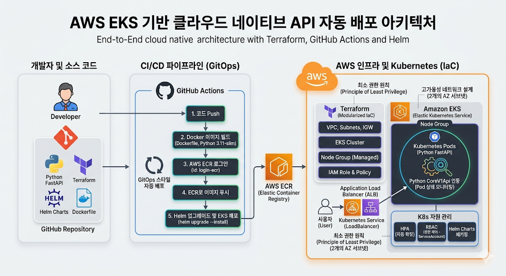

# 🚀 AWS EKS 기반 클라우드 네이티브 API 자동 배포 프로젝트

이 프로젝트는 온프레미스 엔지니어에서 **AWS/DevOps 엔지니어**로 거듭나기 위한 기술적 여정을 담은 **End-to-End 클라우드 네이티브 아키텍처** 실습 프로젝트입니다. **Terraform**을 통한 IaC 관리와 **GitHub Actions & Helm**을 활용한 GitOps 스타일의 CI/CD 파이프라인 구축을 핵심으로 합니다.

---

## 🏗️ Architecture


- **Cloud Platform**: AWS (EKS, ECR, VPC, IAM)
- **Infrastructure**: Terraform (Modularized IaC)
- **Container Orchestration**: Kubernetes (EKS)
- **CI/CD**: GitHub Actions, Helm
- **Application**: Python (K8s Python Client Integration, FastAPI)
- **Networking**: VPC (Public Subnets, IGW), AWS Load Balancer Controller

---

## 🛠️ Tech Stack

### 1. Infrastructure as Code (IaC)
- **Terraform**: VPC, Subnet, IGW, Route Table 등 네트워크 인프라 및 EKS 클러스터, Node Group, ECR 리포지토리 자동 생성.
- **Security**: IAM Role 및 Policy 구성을 통한 **최소 권한 원칙(Principle of Least Privilege)** 적용.

### 2. DevOps & CI/CD
- **Docker**: Python 3.11-slim 기반 경량화 컨테이너 이미지 빌드 및 ECR 관리.
- **Helm**: K8s 리소스(Deployment, Service, HPA, RBAC)의 패키징 및 버전 관리.
- **GitHub Actions**: 
  - 코드 Push 시 Docker 빌드 및 ECR 푸시 자동화.
  - `helm upgrade --install`을 통한 EKS 클러스터로의 무중단 배포 프로세스 구축.

### 3. Cloud-Native Application
- **Python (FastAPI)**: Kubernetes CoreV1Api를 활용하여 클러스터 내부 Pod 상태를 실시간 모니터링하는 API 서버 구현.
- **K8s RBAC**: Pod가 클러스터 정보를 조회할 수 있도록 `ClusterRole` 및 `Binding` 설정.

---

## 🌟 Key Features & Implementation Details

### 1. 고가용성 네트워크 설계
- 2개의 가용 영역(AZ)에 서브넷을 분산 배치하여 장애 내약성(Fault Tolerance) 확보.
- 인터넷 게이트웨이 및 라우팅 테이블 설정을 통한 외부 통신 경로 최적화.

### 2. GitOps 기반의 자동화 파이프라인
- GitHub Actions에서 `id: login-ecr` 출력을 동적으로 참조하여 이미지 태그 주입.
- Helm의 `--set` 플래그를 활용한 가변적 환경 설정(Environment Injection) 구현.

### 3. Kubernetes 자원 관리 최적화
- **HPA**: 트래픽 부하에 따른 파드 수 자동 확장 설정.
- **RBAC**: `ServiceAccount`를 통한 정교한 권한 제어.

---

## 🛠️ Troubleshooting & Lessons Learned (실전 디버깅 기록)

프로젝트 진행 중 발생한 기술적 난관을 해결하며 실무 역량을 강화했습니다.

### ✅ Issue 1: `InvalidImageName` 에러 (CI/CD 파이프라인 오류)
- **현상**: 배포된 Pod가 이미지 주소 형식 오류로 `Pending` 상태 지속.
- **원인**: GitHub Actions에서 ECR 레지스트리 변수 참조 시 `.outputs.registry` 누락.
- **해결**: YAML 문법 교정을 통해 12자리 계정 ID가 포함된 전체 ECR 주소가 Helm으로 전달되도록 수정.

### ✅ Issue 2: `500 Internal Server Error` (K8s 인증 및 권한)
- **현상**: Pod는 실행 중이나 내부 API 호출 시 500 에러 발생.
- **원인**: 앱 코드 내 클러스터 내부 인증(`load_incluster_config`) 부재 및 Pod의 K8s API 조회 권한 미달.
- **해결**: Python 코드 수정 및 `rbac.yaml`을 통한 `ClusterRoleBinding` 적용으로 해결.

### ✅ Issue 3: Helm Chart 구조 및 경로 문제
- **현상**: `Error unpacking subchart` 발생.
- **원인**: `rbac.yaml`이 `templates/` 폴더 외부에 위치하여 Helm이 독립 차트로 오인.
- **해결**: 파일 구조 최적화 및 `templates/` 하위 이동을 통해 정상 배포 성공.

---

## 📁 Project Structure
```text
.
├── .github/workflows/      # GitHub Actions CI/CD Workflow
├── my-api-chart/           # Helm Charts (K8s Manifests)
│   ├── templates/          # Deployment, Service, RBAC, HPA 등
│   └── values.yaml         # Helm 설정 값
├── eks.tf                  # EKS Cluster & Node Group IaC
├── vpc.tf                  # Network Infrastructure IaC
├── main.py                 # FastAPI Application (K8s API 연동)
├── Dockerfile              # 컨테이너 이미지 정의
└── requirements.txt        # Python Dependencies
```

---

## 🚀 How to Run

### 인프라 구축
```bash
terraform init
terraform apply -auto-approve
```

### 애플리케이션 배포 확인
```bash
aws eks update-kubeconfig --region ap-northeast-2 --name portfolio-cluster
kubectl get pods -n default
```
